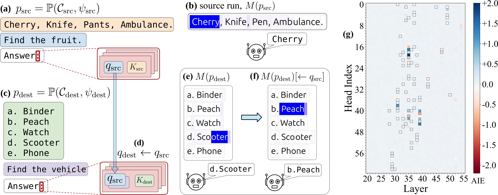

# LLMs Process Lists With General Filter Heads
### [Project Website](https://filter.baulab.info/) | [Arxiv Preprint](https://arxiv.org/pdf/2510.26784)

This repository contains code, data, and visualizations for the paper "LLMs Process Lists With General Filter Heads".

How does an LLM perform *filtering* operation over a list of items? We find that a small set of specialized attention heads, which we call *filter heads*, are responsible for this across a range of different situations. The query states of these heads encode a compact representation of the filtering criterion (the *predicate*), which can be transported to a different context to trigger the execution of the same filtering operation on a different list of items, presented in a different format, language, even different tasks.

<p align="center">

</p> 

Checkout [filter.baulab.info](http://filter.baulab.info) for more details.


## Setup

All code is tested on Ubuntu 20.04 and 24.04 with A100 or A6000 GPUs. We've used python >= 3.11, torch >= 2.7, and transformers >= 4.55. We recommend duplicating our conda environment:

```bash
conda env create -f conda_env.yml
```

* Some of the packages in `conda_env.yml` won't be strictly required for the code to run. We will clean this up in the future.
* `baukit` may not get installed with conda. Please install it separately using `pip install git+https://github.com/davidbau/baukit`.
* You will need to have a `env.yml` file (similar to the [env_demo.yml](env_demo.yml)) in the root directory of the project.


## Code
* Checkout the [demo](demo.ipynb) notebook for a quick overview of the main idea.

* You can locate the filter heads using the [scripts/locate_selection_heads.py](scripts/locate_selection_heads.py) script. Usage:

```bash
python -m scripts.locate_selection_heads --model="<model_name>"
```
Please refer to the script for additional arguments.

* The [data_save](data_save) folder contains the items/entities used to generate the samples for different tasks. Please refer to [src/selection/data.py](src/selection/data.py) for more details.

## Citation
```bibtex
@article{sensharma2023filter,
    title={LLMs Process Lists With General Filter Heads}, 
    author={Arnab Sen Sharma and Giordano Rogers and Natalie Shapira and David Bau},
    year={2025},
    eprint={2510.26784},
    archivePrefix={arXiv},
    primaryClass={cs.CL}
}
```